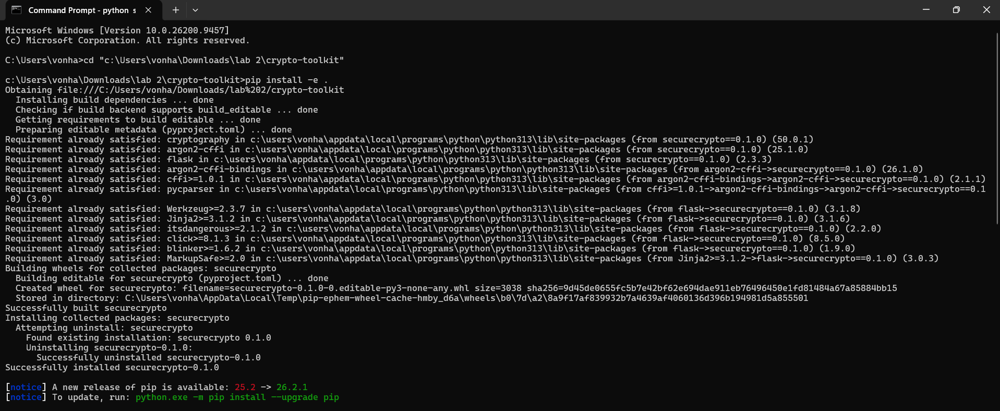
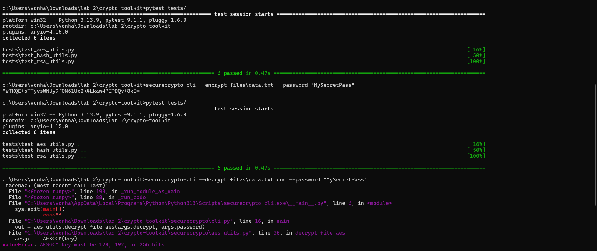
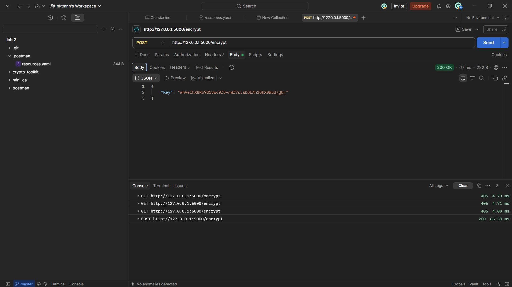
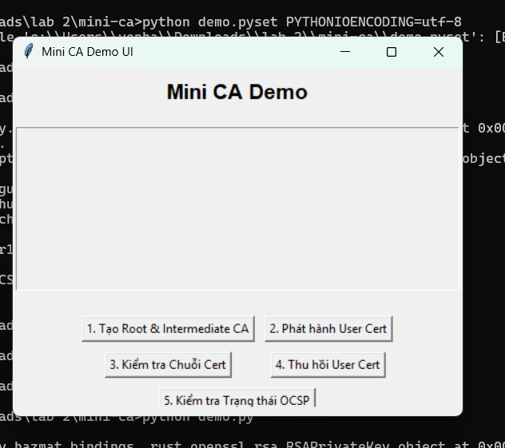

# TH_LTANTT Lab 2: Mật mã & PKI

Đây là kết quả bài thực hành Lab 2: Mật mã học hiện đại và Hạ tầng khóa công khai (PKI).
Bài làm bao gồm 2 phần chính: `crypto-toolkit` và `mini-ca`.

## Phần 1: Thư viện `crypto-toolkit`

Cài đặt các thư viện cần thiết và chạy unit test cho các module AES, Argon2 và RSA.

Kết quả mã hóa file `data.txt` bằng công cụ dòng lệnh (CLI):

Kết quả giải mã file `data.txt.enc` qua CLI:

Sử dụng ứng dụng giao diện (GUI) để mã hóa/giải mã:

Chạy Flask API và kiểm thử qua Postman:

## Phần 2: Hệ thống `mini-ca`

Khởi chạy kịch bản (demo) tạo Root CA, Intermediate CA, phát hành và thu hồi chứng chỉ.

Giao diện quản lý vòng đời chứng chỉ số:

