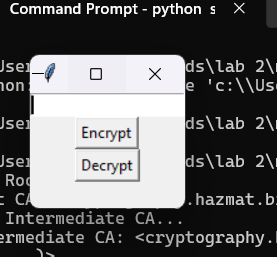
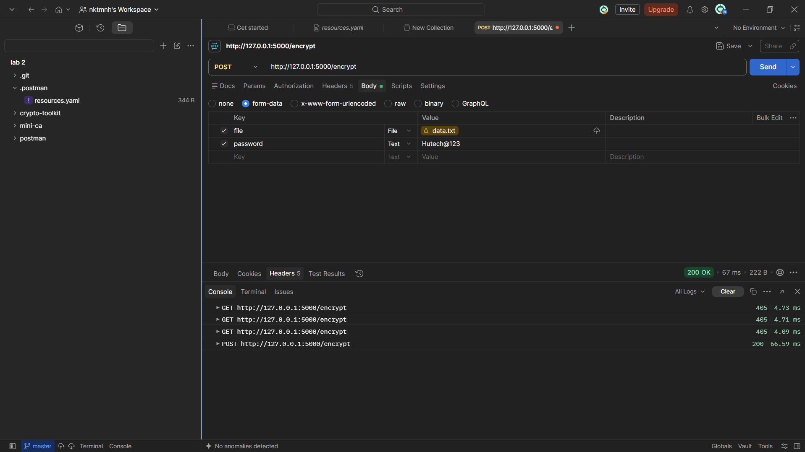
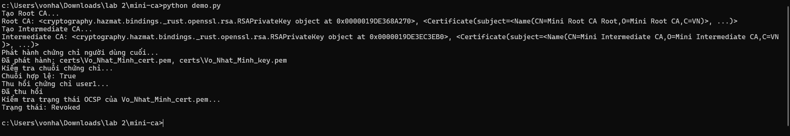

# Lab 2: Mã hóa & Triển khai PKI (Public Key Infrastructure)

Kho lưu trữ này chứa mã nguồn và các bài thực hành cho **Lab 2** môn An toàn thông tin, bao gồm việc xây dựng thư viện mật mã riêng bằng Python (CryptoToolkit) và xây dựng hệ thống cấp phát chứng chỉ số đơn giản (Mini CA).

---

## 📁 Cấu trúc Thư mục Dự án

```text
lab-2/
├── crypto-toolkit/          # Bài 1: Thư viện mật mã và các ứng dụng tích hợp
│   ├── files/               # Chứa dữ liệu mẫu (data.txt)
│   ├── securecrypto/        # Mã nguồn chính của thư viện
│   │   ├── __init__.py
│   │   ├── aes_utils.py     # Mã hóa/giải mã AES-256-GCM
│   │   ├── hash_utils.py    # Băm mật khẩu an toàn bằng Argon2
│   │   ├── rsa_utils.py     # Tạo cặp khóa, ký số và xác thực RSA
│   │   ├── cli.py           # Giao diện dòng lệnh (CLI)
│   │   ├── api.py           # Flask RESTful API
│   │   └── app_gui.py       # Giao diện đồ họa (Tkinter GUI)
│   ├── tests/               # Các bài kiểm thử (Unit Tests)
│   │   ├── test_aes_utils.py
│   │   ├── test_hash_utils.py
│   │   └── test_rsa_utils.py
│   ├── requirements.txt
│   └── setup.py
│
├── mini-ca/                 # Bài 2: Hệ thống Hạ tầng Khóa công khai (PKI)
│   ├── certs/               # Thư mục lưu trữ chứng chỉ, khóa (.pem) và CRL
│   ├── ca_utils.py          # Quản lý CA (Root, Intermediate, End-entity)
│   ├── revoke_utils.py      # Quản lý thu hồi chứng chỉ (CRL/OCSP)
│   ├── demo.py              # Kịch bản chạy thử tự động
│   ├── demo_ui.py           # Giao diện quản lý CA bằng Tkinter
│   └── requirements.txt
│
└── README.md
```

## 🛠️ Hướng dẫn Cài đặt Môi trường Chung
- Đảm bảo máy tính của bạn đã được cài đặt sẵn Python (khuyên dùng Python 3.10+).
- Clone repository này về máy cục bộ.

---

## 🚀 Phần 1: CryptoToolkit (`crypto-toolkit`)
Phần này cung cấp các công cụ mật mã hiện đại gồm mã hóa đối xứng AES-GCM, hàm băm mật khẩu Argon2, chữ ký số RSA, cùng với giao diện CLI, Web API và GUI.

### 1. Cài đặt các gói phụ thuộc & Thư viện
Mở Terminal, di chuyển vào thư mục `crypto-toolkit` và cài đặt gói dưới dạng editable:
```powershell
cd crypto-toolkit
pip install -e .
```

### 2. Chạy Unit Tests
Để kiểm tra tính đúng đắn của các thuật toán mã hóa, băm và chữ ký số:
```powershell
pytest tests/
```


### 3. Sử dụng Giao diện Dòng lệnh (CLI)
Mã hóa file:
```powershell
securecrypto-cli --encrypt .\files\data.txt --password pass123
```


Giải mã file (sử dụng chuỗi key base64 trả về từ lệnh mã hóa):
```powershell
securecrypto-cli --decrypt .\files\data.txt.enc --password <chuoi_key_base64>
```


### 4. Chạy Flask API
Khởi động Local Server qua Flask để kiểm tra API (có thể test bằng Postman hoặc công cụ tương đương):
```powershell
python securecrypto/api.py
```
- **Endpoint Mã hóa (POST):** `http://127.0.0.1:5000/encrypt` (Gửi kèm file và password dạng form-data).
- **Endpoint Giải mã (POST):** `http://127.0.0.1:5000/decrypt` (Gửi kèm file .enc và password là key base64).


### 5. Chạy giao diện đồ họa (GUI)
```powershell
python securecrypto/app_gui.py
```


---

## 🏛️ Phần 2: Hệ thống Mini CA (`mini-ca`)
Phần này mô phỏng hoạt động của một Certificate Authority thực thụ: phân cấp chứng chỉ (Root CA ➔ Intermediate CA ➔ End-entity), xác thực chuỗi tin cậy, thu hồi chứng chỉ và kiểm tra trạng thái thu hồi.

### 1. Cài đặt thư viện
Di chuyển vào thư mục `mini-ca` và cài đặt các gói cần thiết:
```powershell
cd mini-ca
pip install -r requirements.txt
```

### 2. Chạy kịch bản Demo tự động
```powershell
python demo.py
```
Kịch bản này sẽ tự động thực hiện:
- Khởi tạo Root CA và Intermediate CA.
- Phát hành chứng chỉ cho người dùng cuối (Vo_Nhat_Minh).
- Xác thực chuỗi chứng chỉ hợp lệ.
- Thu hồi chứng chỉ và kiểm tra trạng thái thu hồi (mô phỏng OCSP/CRL).



### 3. Chạy giao diện quản lý CA (GUI)
```powershell
python demo_ui.py
```
Giao diện trực quan cho phép bạn bấm nút thực hiện từng bước: Tạo CA ➔ Phát hành chứng chỉ ➔ Kiểm tra chuỗi ➔ Thu hồi ➔ Kiểm tra trạng thái.


