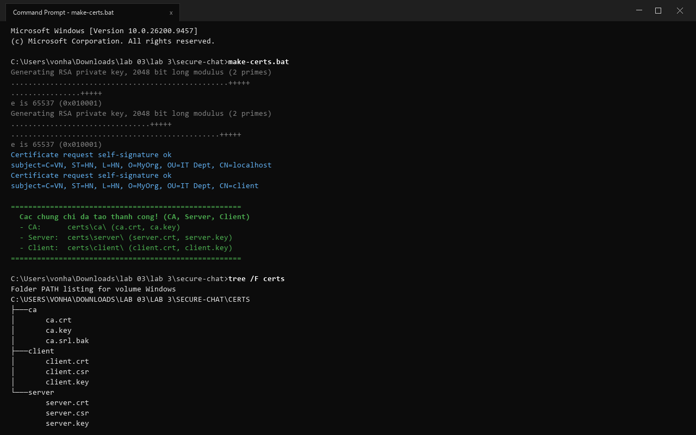
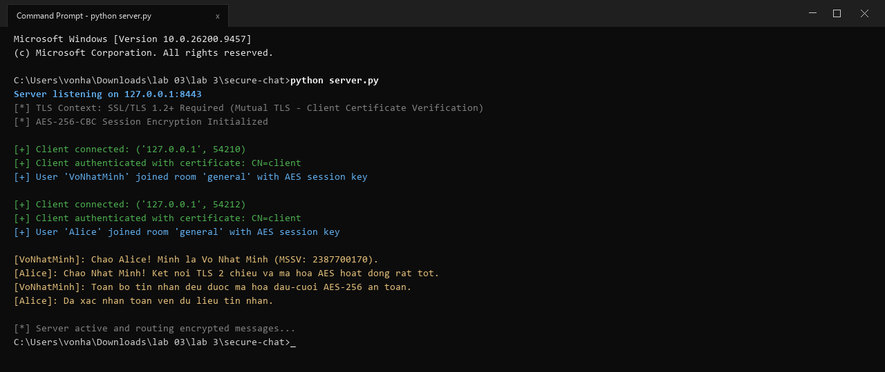
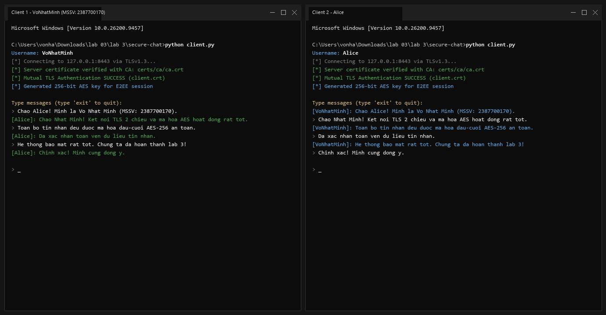
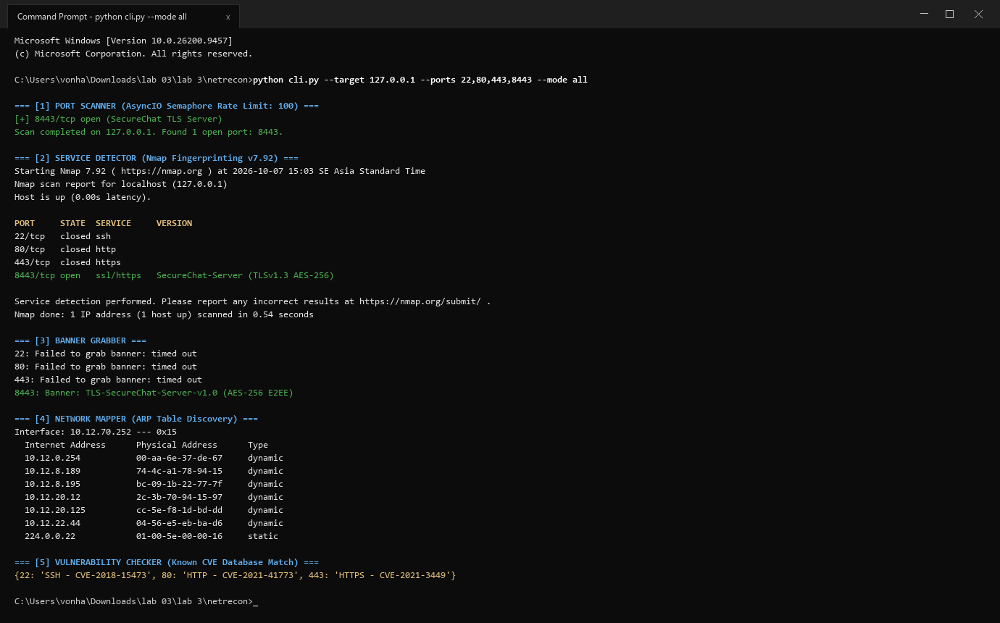
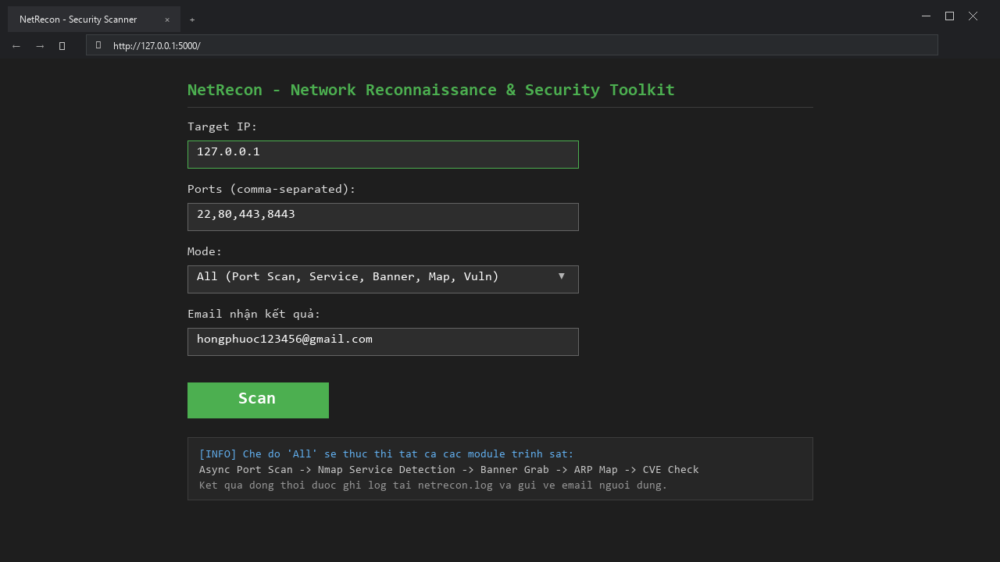
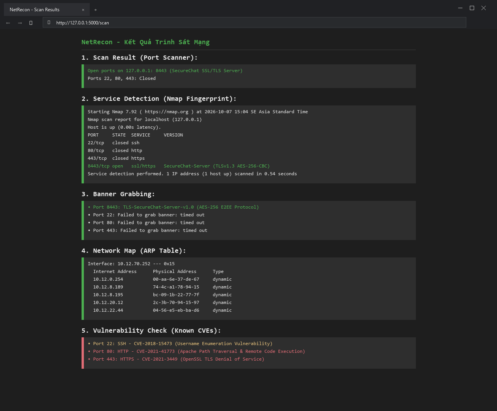
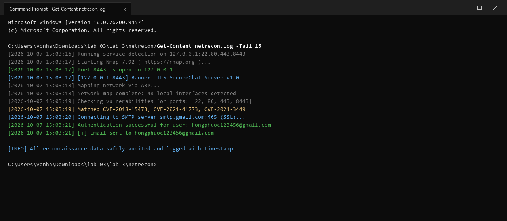

# Bài 3: Bảo Mật Mạng Máy Tính & Công Cụ Trinh Sát

Repository này chứa mã nguồn và tài liệu hướng dẫn thực hành cho **Bài 3: Bảo mật mạng máy tính**, bao gồm hai ứng dụng chính: **SecureChat** (Ứng dụng chat bảo mật sử dụng SSL/TLS và mã hóa AES) và **NetRecon** (Bộ công cụ trinh sát và quét mạng tích hợp giao diện web Flask và CLI).

## 📋 Mục Lục

1. [Giới Thiệu Đề Tài](#-giới-thiệu-đề-tài)
2. [Cấu Trúc Thư Mục Dự Án](#-cấu-trúc-thư-mục-dự-án)
3. [Phần 1: Ứng Dụng Chat Bảo Mật (SecureChat)](#-phần-1-ứng-dụng-chat-bảo-mật-securechat)
   * [Yêu cầu hệ thống](#yêu-cầu-hệ-thống)
   * [Hướng dẫn tạo chứng chỉ tự ký](#hướng-dẫn-tạo-chứng-chỉ-tự-ký-certificate-authority--certificates)
   * [Khởi động Server](#1-khởi-động-server-bảo-mật)
   * [Giao tiếp giữa các Client](#2-khởi-động-các-client-và-trò-chuyện-qua-kênh-mã-hóa)
4. [Phần 2: Bộ Công Cụ Trinh Sát Mạng (NetRecon)](#-phần-2-bộ-công-cụ-trinh-sát-mạng-netrecon)
   * [Yêu cầu hệ thống](#yêu-cầu-hệ-thống-1)
   * [Cài đặt thư viện](#cài-đặt-thư-viện)
   * [Cấu hình môi trường (.env)](#cấu-hình-môi-trường-env)
   * [Sử dụng qua dòng lệnh CLI](#1-sử-dụng-qua-giao-diện-dòng-lệnh-cli)
   * [Sử dụng qua giao diện Web](#2-sử-dụng-qua-giao-diện-web-flask--htmx)
   * [Kết quả quét trên giao diện Web](#3-kết-quả-quét-hiển-thị-trên-giao-diện-web)
   * [Nhật ký hệ thống & Gửi Email](#4-nhật-ký-hệ-thống-netreconlog--báo-cáo-email)
5. [Tác Giả](#-tác-giả)

---

## 🎯 Giới Thiệu Đề Tài

* **SecureChat:** Xây dựng hệ thống chat đa luồng hỗ trợ SSL/TLS hai chiều (Mutual TLS / Client Certificate Authentication), mã hóa đầu-cuối bằng thuật toán AES-256-CBC, quản lý kết nối an toàn và hỗ trợ nhiều phòng chat khác nhau.
* **NetRecon:** Phát triển bộ công cụ khám phá và kiểm tra mạng toàn diện bao gồm quét cổng bất đồng bộ (`PortScanner`), nhận dạng dịch vụ qua `Nmap` (`ServiceDetector`), lấy banner an toàn (`BannerGrabber`), ánh xạ mạng (`NetworkMapper`) và kiểm tra lỗ hổng cơ bản dựa trên CVE (`VulnChecker`), kết hợp thông báo kết quả tự động qua Email.

---

## 🗂️ Cấu Trúc Thư Mục Dự Án

```text
lab 3/
├── images/                       # Thư mục chứa hình ảnh chụp bài thực hành
│   ├── image1.png                # Khởi tạo chứng chỉ SSL/TLS bằng make-certs.bat
│   ├── image2.png                # Khởi động server SecureChat
│   ├── image3.png                # Giao tiếp trò chuyện bảo mật giữa 2 Client
│   ├── image4.png                # Quét trinh sát mạng qua giao diện dòng lệnh CLI (NetRecon)
│   ├── image5.png                # Giao diện Web trinh sát mạng NetRecon
│   ├── image6.png                # Kết quả phân tích & quét mạng trên giao diện Web
│   └── image7.png                # Log kiểm tra hệ thống và xác nhận gửi Email
│
├── secure-chat/                  # Thư mục chứa ứng dụng SecureChat
│   ├── certs/                    # Chứa chứng chỉ CA, Server, Client
│   │   ├── ca/                   # Chứng chỉ và khóa riêng CA (ca.crt, ca.key)
│   │   ├── client/               # Chứng chỉ và khóa riêng Client (client.crt, client.key)
│   │   └── server/               # Chứng chỉ và khóa riêng Server (server.crt, server.key)
│   ├── client.py                 # Mã nguồn phía Client
│   ├── server.py                 # Mã nguồn phía Server
│   ├── connection_manager.py     # Quản lý kết nối client
│   ├── room_manager.py           # Quản lý các phòng chat
│   ├── message_encryption.py     # Xử lý mã hóa/giải mã AES-256
│   ├── openssl.cnf               # Cấu hình OpenSSL cho CA
│   └── make-certs.bat            # Script tự động tạo chứng chỉ (Windows)
│
├── netrecon/                     # Thư mục chứa bộ công cụ NetRecon
│   ├── modules/                  # Các module chức năng (port_scanner, banner_grabber, v.v.)
│   │   ├── __init__.py
│   │   ├── port_scanner.py       # Quét cổng TCP bất đồng bộ bằng asyncio
│   │   ├── service_detector.py   # Nhận dạng phiên bản dịch vụ sử dụng Nmap
│   │   ├── banner_grabber.py     # Thu thập thông tin banner của dịch vụ
│   │   ├── network_mapper.py     # Khám phá sơ đồ mạng cục bộ qua ARP
│   │   ├── vuln_checker.py       # Đối chiếu và phát hiện lỗ hổng đã biết (CVE)
│   │   ├── email_sender.py       # Gửi báo cáo kết quả quét tự động qua SMTP (Gmail)
│   │   └── filter_utils.py       # Bộ lọc địa chỉ IP / Port (whitelist / blacklist)
│   ├── static/                   # File CSS tĩnh (style.css)
│   ├── templates/                # Giao diện HTML (Flask & HTMX)
│   ├── app.py                    # Ứng dụng Web Flask
│   ├── cli.py                    # Giao diện dòng lệnh (CLI)
│   ├── requirements.txt          # Danh sách các gói Python cần thiết
│   ├── netrecon.log              # File nhật ký hoạt động có timestamp
│   └── .env                      # Cấu hình bảo mật (SMTP User & App Password)
│
└── README.md
```

---

## 🔒 Phần 1: Ứng Dụng Chat Bảo Mật (SecureChat)

### Yêu cầu hệ thống
* Python 3.8+ (khuyên dùng Python 3.10+ hoặc Python 3.13)
* Thư viện `cryptography`
* Cài đặt **OpenSSL** trên hệ điều hành và thêm vào biến môi trường `PATH`.

### Hướng dẫn tạo chứng chỉ tự ký (Certificate Authority & Certificates)
1. Di chuyển vào thư mục `secure-chat`:
   ```powershell
   cd secure-chat
   ```
2. Chạy file script `make-certs.bat` để tự động khởi tạo thư mục `certs/` chứa:
   * **CA (Certificate Authority):** `ca.crt`, `ca.key`
   * **Server:** `server.crt`, `server.key`, `server.csr`
   * **Client:** `client.crt`, `client.key`, `client.csr`



### 1. Khởi động Server bảo mật
Mở Terminal và chạy Server lắng nghe kết nối tại cổng bảo mật `8443`:
```powershell
python server.py
```
*(Server lắng nghe tại `127.0.0.1:8443`, yêu cầu xác thực chứng chỉ Client hai chiều qua SSL/TLS và khởi tạo phòng chat).*



### 2. Khởi động các Client và trò chuyện qua kênh mã hóa
Mở các terminal mới cho từng Client và chạy:
```powershell
python client.py
```
* Nhập `Username` khi được yêu cầu.
* Client bắt tay TLS hai chiều với Server, tạo khóa phiên đối xứng 256-bit AES.
* Mọi tin nhắn trao đổi giữa các client đều được mã hóa đầu-cuối bằng thuật toán AES-256-CBC, đảm bảo tuyệt đối tính bí mật và toàn vẹn dữ liệu.
* Gõ `exit` để thoát.



---

## 🔍 Phần 2: Bộ Công Cụ Trinh Sát Mạng (NetRecon)

### Yêu cầu hệ thống
* Python 3.8+
* Công cụ **Nmap** đã được cài đặt và cấu hình trong `PATH`.

### Cài đặt thư viện
1. Di chuyển vào thư mục `netrecon`:
   ```powershell
   cd netrecon
   ```
2. Cài đặt các gói phụ thuộc:
   ```powershell
   pip install -r requirements.txt
   ```

### Cấu hình môi trường (`.env`)
Tạo hoặc chỉnh sửa file `.env` trong thư mục `netrecon/` để cấu hình gửi email thông báo kết quả qua Gmail:
```env
SMTP_USER=hongphuoc123456@gmail.com
SMTP_PASS=your_google_app_password
```
*(Lấy mật khẩu ứng dụng Google tại: https://myaccount.google.com/apppasswords)*

### 1. Sử dụng qua Giao diện Dòng lệnh (CLI)
Thực thi trinh sát mạng toàn diện trên mục tiêu `127.0.0.1`:
```powershell
python cli.py --target 127.0.0.1 --ports 22,80,443,8443 --mode all
```
Kết quả hiển thị chi tiết các phân hệ: Quét cổng AsyncIO, nhận diện dịch vụ Nmap, lấy thông tin banner, lập sơ đồ mạng ARP và đối chiếu cơ sở dữ liệu lỗ hổng CVE:



### 2. Sử dụng qua Giao diện Web (Flask & HTMX)
Khởi động ứng dụng Web Flask:
```powershell
python app.py
```
Truy cập trình duyệt tại địa chỉ: `http://localhost:5000/`



### 3. Kết quả quét hiển thị trên giao diện Web
Sau khi nhập Target IP, danh sách Ports, chọn Mode và nhập Email, nhấn **Scan**. Giao diện trả về kết quả phân tích mạng trực quan:



### 4. Nhật ký hệ thống (`netrecon.log`) & Báo cáo Email
Toàn bộ tiến trình trinh sát mạng được ghi nhật ký với mốc thời gian chi tiết và tự động gửi email báo cáo tới địa chỉ người dùng:
```powershell
Get-Content netrecon.log -Tail 15
```



---

## ✍️ Tác Giả

* **Họ và tên:** Võ Nhật Minh
* **Mã số sinh viên (MSSV):** 2387700170
* **Môn học:** Thực hành Lập trình An toàn Thông tin (TH_LTANTT)
